# FlowParameters
Processing of flow data with Python scripts

This repo contains the Python scripts associated with the report: 

Glacial flow analysis with open source tools: the case of the Reeves Glacier grounding zone, East Antarctica

by Mauro Alberti (alberti.m65@gmail.com) and Debbie Biscaro (debbiemail@libero.it).

First published August 8, 2011 in www.malg.eu/glacial_flows.php

 

Republished in GitHub, August 1, 2017.

1 &nbsp;|&nbsp; Posted by <a href="mailto:alberti.m65@gmail.com">mauro</a>

 

<h2>Glacial flow analysis with open source tools: the case of the Reeves Glacier 
	grounding zone, East Antarctica
</h2>

	Mauro Alberti (<a href="mailto:alberti.m65@gmail.com">alberti.m65@gmail.com</a>), 
	Debbie Biscaro (<a href="mailto:debbiemail@libero.it">debbiemail@libero.it</a>)

<h2>Abstract</h2>

We describe a suite of Python tools for the study of glacial flows (and 2D flows in general) that 
integrates with GIS and Scientific Visualization software. These tools allow to import and clean raw flow data produced by IMCORR, 
and derive flow-related parameters, i.e. divergence, curl magnitude and speed variations along flow lines. 
As a case study, we investigate the flows in the grounding zone of the Reeves Glacier, 
an outlet glacier in the Terra Nova Bay (Victoria Land, East Antarctica) for the period 2001-2003. 
Flow anomalies are frequent, related to both emerged and sub-glacial obstacles, and to unrecognised factors.

		
<h2>1. Introduction</h2>

Glacier flows in remote regions of the Earth as Antarctica can be investigated thanks to satellite observations. 
One commonly used method to derive the flows is based on the correlations between subimages in two co-registered images 
(e.g., Scambos et al., 1992). Since the result corresponds to a vector field, it could be characterized by 
physical parameters such as <i>divergence</i>, that measures the vector tendency to converge or diverge, 
<i>curl</i>, that measures their rotations, and <i>speed variations along flow lines</i>. 
The visualization of a vector field by means of streamlines can help in defining flow relations with the environmental and physical parameters.
Unfortunately, GIS software lack any function for vector data processing, and are also extremely limited in 
the vector field visualization capabilities (differently from scientific visualization software as  
ParaView and VisIt). 

We created a set of tools for vector field data processing using Python, an open-source, 
high-level, scripting language. Python has bindings to GIS libraries such 
as <i>ogr</i> and <i>gdal</i> that facilitate the processing of GIS layers. Python implementations 
that include GIS-oriented libraries are Python(x,y) and the FWTools suite, by Frank Warmerdam. 
As a case study, we apply these tools to the Reeves Glacier, an Antarctic outlet glacier in the Terra Nova Bay area (East Antarctica).
We consider its grounding zone and the initial portion of its confluence into the Nansen Ice Sheet. 

<h3>2. Methodology</h3>

Displacement vectors can be derived by comparing images taken at different periods and  
matching sub-zones between two co-registered image pairs. A widely used software applied to glacial investigations 
is the open-source IMCORR. It is available for Unix, Linux and also Windows via Cygwin.
It derives vector displacements from co-registered images by means of Fast Fourier Transform  
techniques (Scambos et al., 1992). IMCORR is implemented in C and uses some Fortran subroutines 
written at NASA Goddard Space Flight Center and USGS Eros Data Center.  IMCORR matches corresponding reference chips in two compared images. The user chooses the size 
of the search subregion ('search chip') and the searched subregion ('reference chip'). 
Program result is in ASCII format with a raster (grid) structure, with data representing the inferred displacement vector. 
An estimation of the result quality ('strength of correlation') and the estimated error are also calculated.
Interested user can refer to the IMCORR web site and to Scambos et al. (1992) for further details.

We relied on Numpy, a Python library that allows vectorised processing of array data 
(Langtangen, 2008). Fig. 1 illustrates the suggested processing flow for data importing, cleaning and conversion.
Result can be imported in GIS using the script <i">imcorr2vectors</i>.
Since errors are frequently found, result must be cleaned prior to any analysis. Manual cleaning is a time-consuming operation, 
so we created a tool to automate it. <i>vectors_coherence</i> is a script that determines local size and orientation deviations between vectors, 
in order to highlight potential errors. Resulting layers can be converted to and from shapefiles with <i>vectors2shapefile</i> and
<i>shapefile2vectors</i> scripts. Validated data can be interpolated with conventional GIS tools applied to the Cartesian components, 
in order to obtain a spatially-continuous field. Flow field parameters can be calculated 
with the <i>vector_field_par</i> script.

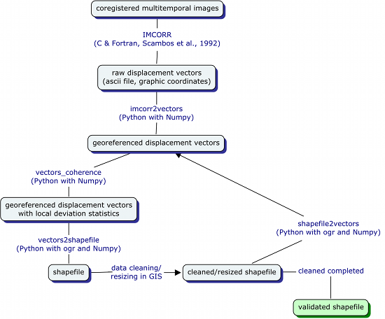

<i>Fig. 1. Diagram representing suggested data processing flow.</i>

<h4>2.1. IMCORR output georeferencing and conversion to/from shapefile</h4>

IMCORR raw data require both a preliminary georeferencing processing (since displacement vectors are in graphical coordinates) 
and data cleaning, due to sub-images mismatch and co-registration errors. <i>imcorr2vectors</i>
reads geographical parameters provided by the user in a parameter file (cell size in geographic units, minimum x value, maximum y value) and creates a 
georeferenced ASCII file. This last file can be processed by the flow coherence script, or converted to a shapefile with 
<i>vectors2shapefile</i>, an ASCII-to-shapefile conversion script that outputs a line shapefile. This shapefile 
represents the displacement vectors as segments, with attributes derived from the IMCORR output. 
A complementary shapefile-to-ASCII script is <i>shapefile2vectors</i>.

<h4>2.2. Raw data cleaning: flow coherence parameters</h4>

We implemented <i>vectors_coherence</i>, a flow coherence algorithm to facilitate IMCORR raw data cleaning. 
It calculates the difference in vector size and orientation with respect to the mean values of its neighbouring eight vectors, 
using a 3x3 square kernel. The neighbouring vector values are weighted by the correlation strength provided by IMCORR. 
Erroneous results should display medium-to-strong deviations from the mean. 
Since incorrect values can worsen the statistics of correct neighbours, a visual inspection of records 
prior to any automatic deletion is suggested. 

The input file is a georeferenced file deriving from the 'imcorr2vectors' script or from data that 
already underwent a cleaning step (the cleaning process can be iterated a few times). A georeferenced file can 
be converted to a shapefile with the 'vectors2shapefile' script and cleaned within a GIS software by deleting 
the records with the highest displacement magnitudes. It can be converted again to a <em>vector</em> format with 'shapefile2vectors'.
The deviation parameters can be calculated again with <i>vectors_coherence</i> and a new cleaning step performed. 
Shapefiles can be clipped to an interest zone, and the <i>vectors_coherence</i> script will work properly on the new dataset. 
After some cleaning steps, most or all errors can be considered removed. 
The next phase is the removal of co-registration errors.

<h4>2.3. Elimination of co-registration errors</h4>

Image co-registration is never entirely accurate. Misalignments between co-registered images generate 
displacements that must be removed from the total displacement field. A common strategy to evidence
this kind of errors is by verifying the displacement field magnitudes where no movement should be observed, i.e., in rock outcrops. 
When observed, these errors can be spatially uniform, or present spatial variations. 
In the former case, their mean value can be used for the removal of co-registration errors. In the latter case, 
an error-related vector field can be derived by interpolations with kriging, radial basis functions or other techniques 
(Burrough & McDonnell, 1998). The co-registration error vector components can then be subtracted from the total 
displacement vectors.

<h4>2.4 Interpolation of a continuous vector field</h4>

Data cleaning steps can produce holes in the cleaned dataset. 
Since spatial analyses are better performed using continuous fields, data should be interpolated to create a continuous vector field. 
Vector interpolations can be performed by separately interpolating the two layers representing the x and y Cartesian components of 
the vector field.

<h4>2.5. Vector field divergence, curl and speed variations along flow lines</h4>

Divergence and curl are physical parameters frequently used to characterize the state of fluid-like materials. 
They are calculated using the differential operator nabla (Shey, 1997):
 
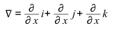  (1)
 

The divergence is a scalar value derived from the scalar product of nabla and the vector field in the neighbourhood of a 
point (<em>x, y, z</em>):
 
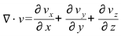  (2)
 

that indicates the tendency of a flow to diverge (positive values) or converge (negative) at that point. 
Applying this operator to a 2D vector field, its divergence will be a scalar field computed only from the x and y components.

The curl is a vector derived from the product of nabla and vector field:
 
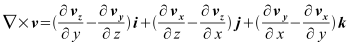  (3)

For a 2D vector field case, the curl will be constantly vertical with its magnitude equal to the k module. Positive values 
rotate counter-clockwise, negative one rotate clockwise.

Another interesting parameter of a velocity field is the velocity variations along flow 
directions. To calculate this parameter, we modify the equation for a DEM directional slope (Neteler & Mitasova, 2008, eq. A.27):
 
velocity change along flow = (dz/dx) * sin(alpha) + (dz/dy) * cos(alpha)	 		(4)
 
where <i>alpha</i> is the local orientation of the flow line and the velocity change is per unit length.

All the considered parameters need the estimation of the gradient along the Cartesian axes, 
function available in the <em>Numpy</em> package). For gridded data, 
gradient is estimated using central differences within a 3x3 kernel or, for boundary cells, using first differences  (Fig. 2).

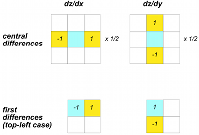

	<i>Fig. 2. Gradient calculation with central differences (top) and first differences (bottom) methods. 
	Numbers inside cells are the weights applied to cell values.
	</i>

These parameters can be derived using the <ai>vector_field_par</i> script. Its input are
two grids, in ASCII ESRI format and storing the x and y components of the vector field respectively. 
Output grids represent scalar fields also in the case of curl, since only 
its magnitude is of interest. The output is in ASCII ESRI format, plus a VTK file storing the original data and all 
resulting fields. This VTK file can be used for advanced visualizations with VTK, ParaView or VisIt.

<h3>3. Glacial flows in the grounding zone of the Reeves Glacier (Victoria Land, East Antarctica)</h3>

We examine the glacial flows of the Reeves Glacier at its confluence in the Nansen Ice Sheet (a historical name, in fact it 
is an ice shelf), in the Terra Nova Bay area, East Antarctica (Fig. 3). In this area, flows present variations 
probably related to the influence of the local bedrock morphology (Baroni et al., 1991).
Data is from a study of glacial outlet ice discharges along the Terra Nova Bay and the Cook Ice Shelf (Biscaro, 2010). 
We describe the main processing steps for producing the dataset. The glacial flows in the Terra Bay Bay area derive from
comparison of the panchromatic bands of two Landsat 7 ETM+ images (years 2001 and 2003, time interval of 400 days). Images 
cover the same zone (i.e., same location of the scene center, equal path and row numbers) and the same seasonal period. 
They were co-registered, clipped to the same area and exported as a gray-scale band for IMCORR processing. After testing, 
the optimal sizes for reference and search chips were 64 and 192 pixels, respectively. IMCORR results were validated using 
the presented programs (see Fig. 1 for the processing flow). Residual co-registration errors are almost constant within the 
area, so outcrop average x and y displacement components were removed from the data set. 
The displacements in the interior zones are less than 100 m while they grow to 100-200 m within glaciers. In the floating 
ice zone, i.e., in the so called Nansen Ice Sheet, displacements are in general larger than 200-300 m. A striking anomaly 
is in the Reeves Glacier grounding zone, between Andersson Ridge and Teall Nunatak, where there is a fast speed increase 
to displacements of almost 400 m, followed by a gradual decrease when continental ice flows into the Nansen Ice Sheet.

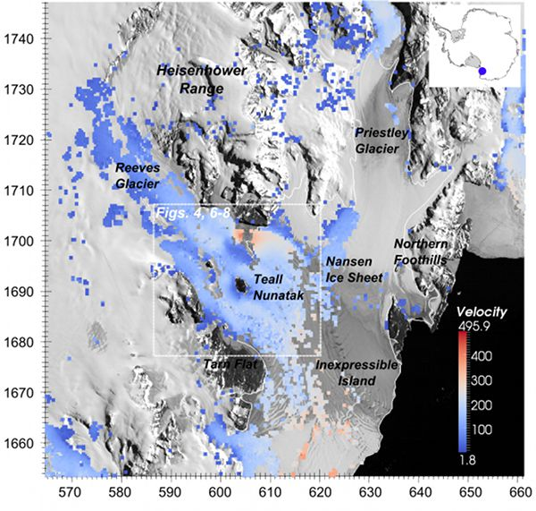

	<i>Fig. 3. Map of the Nansen Ice Sheet area (Victoria Land, East Antarctica) with flow speeds obtained with IMCORR. 
	The grounding line is represented by a white line. The base map is a 2001 
	panchromatic Landsat mosaic. Grid coordinates are in km, North at the top.
	</i>

<h3>3.1. Derivation of the velocity field in the Reeves Glacier grounding zone</h3>

We clipped the data to the extent of the Reeves Glacier grounding zone and re-validated them. 
The resulting data set is made up of 2918 displacement measures distributed in an area of 20 x 35 km, spanning both 
grounded and floating portions of the Reeves Glacier (Fig. 4).
  
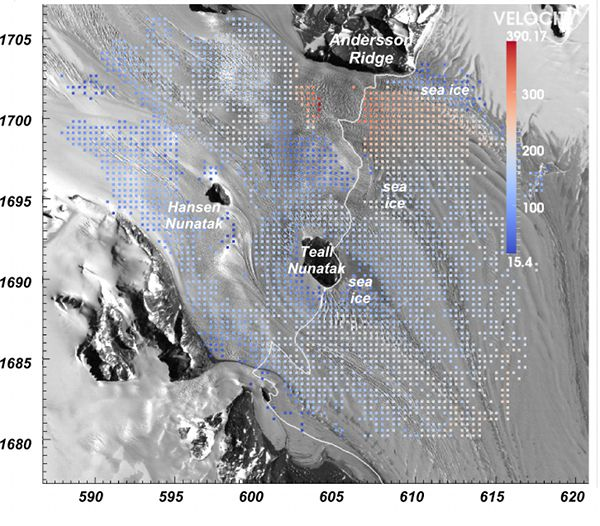

	<i>Fig. 4. Map with the velocity measures used for field interpolation (displacements in meters, time interval of 400 days). 
	The grounding line is represented by a white line. The base map is a 2001 panchromatic Landsat mosaic. 
	Grid coordinates are in km, North at the top.
	</i>

Since glacial flows have smooth spatial variations, we used a spline technique, the <i>Regularised Spline with 
Tension and Smoothing</i> (RSTS, Mitasova & Mitas, 1993, Mitasova et al., 1995), to derive continuous velocity field components. 
The chosen grid resolution was set equal to the original IMCORR grid spacing, i.e. 356.2 meters. Smoothing value was set to 0.1, 
since we consider data to incorporate a small amount of noise, corresponding to errors or local fluctuations in which we 
are not interested. We tested different tension values with the cross-validation option. The cross-validation statistics 
help in choosing the optimal interpolation parameters. We considered two error statistics, the mean of absolute values (MAV) 
and the population standard deviation (PSD). Both x and y component statistics produced a minimum of cross-validation errors 
at a tension value equal to 100 (Fig. 5). This value was consequently chosen for the interpolation phase. To test the sensitivity of 
the results to the chosen parameters, we also interpolated using smoothing parameter values of 0.0, 0.2 and 0.3, and a few 
other tension values. The results showed only minor changes in interpolated velocities and derived flow parameters.

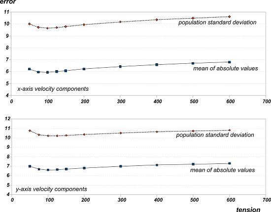

	<i>Fig. 5. Cross-validation errors (both population standard deviation and mean of absolute values) of the  velocity components 
	along the x (top) and y (bottom) axes, for various different values of the tension parameter in the RSTS algorithm. 
	The smoothing value is 0.1. The minimum values of the errors are for tension equal to 100.
	</i>

<h3>3.2. Flow-field characteristics</h3>

We investigate the flow by considering the spatial characteristics and variations of its main parameters, i.e., magnitude, 
streamline pattern, divergence, curl and speed variation along flow directions. These parameters were visualised 
using ParaView, an open source scientific visualization software. Since the observed variations of the curl magnitude field are extremely smooth 
and rarely informative, we omit it in the following discussion.

Flow speeds are represented in Fig. 6. 
A long-range longitudinal gradient is evident between the most internal, grounded ice, where displacements are of about 50-100 m, 
with the notable exception of the area South of Andersson Ridge, and the most external, floating ice whose displacements are of about 200 m. 
A transversal gradient between the slower, southern fluxes and the faster, northern ones is also evident for the grounded ice, while in the most external zones of the floating ice 
it disappears. Strong local anomalies, related to the influence of the local bedrock morphology, superimpose 
on the longitudinal and transversal gradients (Baroni et al., 1991).

By considering the pattern of streamline divergence and convergence, together with the speed and their variations along the flow lines, 
we infer the presence of four subglacial structures. Three of these structures act as obstacles to the flow (labelled as A, B and C 
in ellipses representing their approximate locations in Figs. 6 and followings). The fourth structure, located just South of Andersson 
Ridge, is a strong flow enhancer. We consider the main characteristics of these features and their relationships with the flow 
parameters.

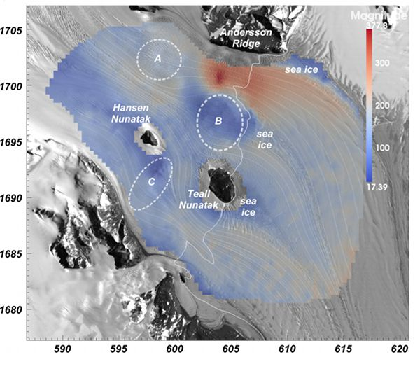

<i>Fig. 6. Speeds and streamlines in the analysed area (meters/total period, legend at the top-left). 
Circles with capital letters inside (A, B and C) are positioned in correspondence of inferred subglacial obstacles. 
The grounding line is represented by a white line. The base map is a 2001 panchromatic Landsat mosaic. 
Grid coordinates are in km, North at the top.
</i>

			

The three features with the largest impacts on the flows are all located just upstream of the grounding line. Teall Nunantak and 
obstacle B are associated with strong negative velocity anomalies, continental ice fragmentation and sea ice formation in their 
rear (Fig. 6). There is no obvious velocity variation near Hansen Nunatak and obstacles A and C. This fact is possibly due to 
their more internal position, with larger ice thickness and little influence of bedrock.

The third feature upstream of the grounding line is the positive velocity anomaly between Andersson Ridge and obstacle B. This 
anomaly is evident also at the scale of the whole Terra Nova Bay area (cf. Fig. 3). In correspondence to obstacle A, a negative 
divergence anomaly develops. Afterwards, ice doubles its velocity in just 5 km, and a crevasse field develops. Ice then decelerates 
(cf. Fig. 8) reducing displacement values to the usual 200 m in a distance of about 10 km on the left side, and of 5 km on the 
right side, at the boundary with obstacle B (Figs. 6, 8). This change is possibly related to one or more suitable substrate 
conditions such as strong downward slopes, lubrificated sediment presence, or reduction of the flow section requiring higher velocities 
to maintain constant fluxes.

Subaerial and subglacial obstacles segment the floating ice into three main bodies, the northern branch that begins floating 
between Andersson Ridge and obstacle B, a central body with reduced volume originating between obstacle B and Teall Nunatak, and 
the southern body South of Teall Nunatak. At the margins of these main floating ice bodies, velocities are reduced, continental 
ice fragments and sea ice forms. When floating, the ice volumes are forced to rotate clockwise, especially the northern and central 
bodies, due to the interaction with the glacial volumes of the Priestley Glacier, whose movements are constrained to the East by 
the Northern Foothills and Inexpressible Island (cf. Fig. 3). The three continental ice bodies present cyclical positive-negative 
anomalies in the divergence and the speed variation fields (Figs. 7 and 8). These anomalies have spacings of 1-2 km and are elongated 
perpendicularly to the flow lines. These features are produced whichever smoothing and tension parameters are chosen for the field 
interpolation. We are in doubt whether they are simply artefacts produced along the data production and processing chain, or 
represent natural structures.

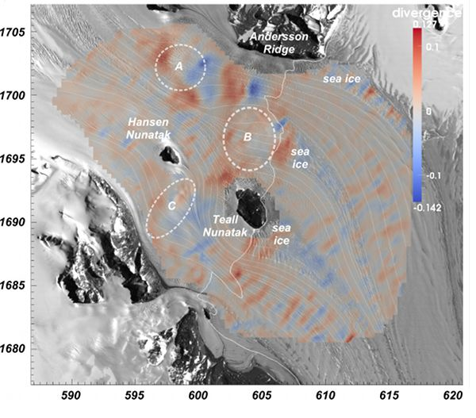

	<i>Fig. 7. Divergence field, together with typical streamlines (legend at the top-left). Circles with capital letters inside 
	(A, B and C) are positioned in correspondence of inferred subglacial obstacles. The grounding line is represented by a white line. 
	The base map is a 2001 panchromatic Landsat mosaic. Grid coordinates are in km, North at the top.
	</i>

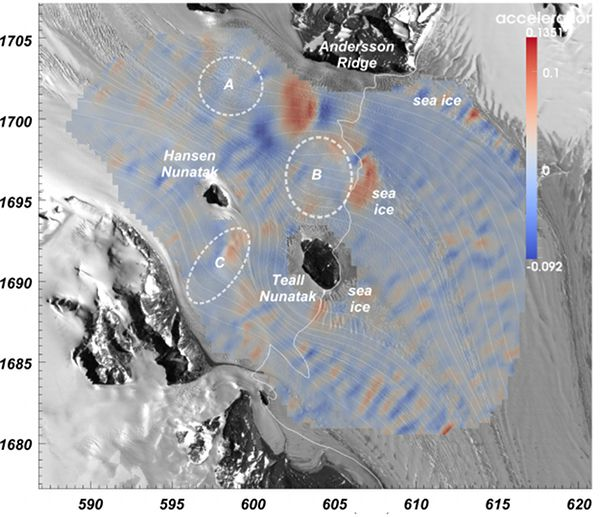

	<i>Fig. 8. Speed rates along flow lines, together with typical streamlines (legend at the top-left). 
	Circles with capital letters inside (A, B and C) are positioned in correspondence of inferred subglacial obstacles. 
	The grounding line is represented by a white line. The base map is a 2001 panchromatic Landsat mosaic. 
	Grid coordinates are in km, North at the top.
	</i>

<h3>4. Conclusions</h3>

The integration of GIS and Scientific Visualization software with Python tools allows to detail the characteristics of glacial 
flows and 2D flows in general. Analysis of Reeves Glacier (East Antarctica) grounding zone flow-field shows the impact of emerged 
and subglacial bedrock structures. These structures control the flow magnitude and direction and promote strong speed variations
along flow lines. Flow obstacles are evidenced by streamlines deviations, associated to positive divergences at 
the rear of the obstacles and in some cases to flow velocity reduction. Local bedrock structures can also promote positive velocity 
anomalies, both in the grounded area or downstream of the grounding line. High-frequency, cyclical variations are observed both for 
the divergence and speed variation fields in the floating ice zone. Their causes are unclear, whether natural or artefact generated 
during data processing.

<h3>Acknowledgements</h3>

Maps were produced with Paraview 3.8.1. GIS processing were performed with Grass; statistical analyses with R. Texts and 
spreadsheets were created with OpenOffice. The developers of all these open source software are thanked.

<h3>References</h3>

<ul>
<li>Baroni, C. Frezzotti, M., Giraudi, C., Orombelli, G., 1991. Ice flow and surficial variations inferred from satellite 
image and aerial photograph analysis of Larsen ice tongue, Hells Gate and Nansen ice shelves (Victoria Land, Antarctica). 
Memorie della  Societ&agrave; Geologica Italiana 46, 69-80.
</li>

<li>Biscaro, 2010. Applicazioni di metodi di telerilevamento per lo studio dei ghiacciai di Terra Nova Bay e della 
Cook Ice Shelf, Antartide orientale (Applications of remote sensing methods to the study of Terra Nova Bay and Cook 
Ice Shelf glaciers, Eastern Antarctica). Ph.D. Dissertation, Siena University, Italy, 173 pp.
</li>

<li>Burrough, P.A, McDonnell, R.A, 1998. Principles of Geographical Information Systems. Oxford University Press, UK, 326 pp..
</li>

<li>Langtangen, H.P., 2008. Python scripting for computational science. Springer, Berlin, DE, 750 pp.
</li>

<li>Mitasova, H., Mitas, L., 1993. Interpolation by Regularised Spline with Tension: I. Theory and implementation. 
Mathematical Geology 25, 641-655.
</li>

<li>Mitasova, H., Mitas, L., Brown, B.M., Gerdes, D.P., Kosinovsky, I., 1995. Modeling Spatially and Temporally Distributed 
Phenomena: New Methods and Tools for GRASS GIS. International Journal of GIS 9, Special Issue on Integration of Environmental 
Modeling and GIS, 443-446.
</li>

<li>Neteler, M., Mitasova, H., 2008. Open Source GIS: A GRASS GIS Approach. Springer, Berlin, DE, 406 pp.
</li>

<li>Scambos, T. A., Dutkiewicz, M. J., Wilson, J. C., Bindschadler, R. A., 1992. Application of image cross-correlation 
to the measurement of glacier velocity using satellite image data. Remote Sensing of Environment 42, 177-186.
</li>

<li>Shey, H.M., 1997. Div, grad, curl and all that. An informal text on vector calculus. Norton & C., New York, NY, 176 pp.
</li>

</ul>

<h2>Script details</h2>

<h3>IMCORR output conversion</h3>	

	imcorr2vectors.py converts an IMCORR file from a graphic, gridded space into a 'vector' file, i.e., a tabular, text file 
	with points and field values in the geographic space.				

	

<h4>Implementation</h4>

		
	<i>Language</i>: Python 2.6 
	<i>Required modules</i>: numpy 
	<i>Version</i>: 2010-08-28 

<h4>Program input</h4>

	The input is the file created by IMCORR, together with some information on
	the used images.				

	An example command line is:
	 
	
	imcorr2vectors.py par.txt
	
	where par.txt is a parameter file with required input and output information. 
	 Example:
	
	11resize.out  // name of Imcorr file
	 14.25  // cell size of analysed raster images
	 536462.625 // x_min: images bottom-left x coordinate
	 1776611.625 // y_max: images top-right y coordinate
	 res.txt // output displacement vectors 
	

<h4>Program output</h4>

	The result is a text file with the original data converted in the geographic space.
	For each displacement vector, the following information are provided:
	<ol style="margin-left: 20px; font-style: italic;">
		<li>px_j: reference chip center, x coordinate</li>
		<li>px_i: reference chip center, y coordinate</li>
		<li>x0: displacement vector start, x coordinate</li>
		<li>y0: displacement vector start, y coordinate</li>
		<li>x1: displacement vector end, x coordinate</li>
		<li>y1: displacement vector end, y coordinate</li>
		<li>dx: inferred displacement, x component</li>
		<li>dy: inferred displacement, y component</li>
		<li>x_err: estimated error, x component</li>
		<li>y_err: estimated error, y component</li>
		<li>magn_displ: magnitude of displacement vector</li>
		<li>displ_dir: displacement vector orientation (0-360 &deg;)</li>
		<li>corrstr: correlation strength (same as from IMCORR output)</li>
		<li>resflg: result flag (same as from IMCORR output)</li>				
	</ol>
	 
	This file can be directly imported in GIS softwares.

<h3>Vector-shapefile conversion</h3>	

	vectors2shapefile.py converts a 'vector' file, as created by the script <i">imcorr2vectors_01.py</i>,
	into a point shapefile. All the original information are preserved.

	

<h4>Implementation</h4>

		
	<i>Language</i>: Python 2.6 
	<i>Required modules</i>: ogr 
	<i>Version</i>: 2010-08-28 

<h4>Program input</h4>

	The input is the file created by <i>imcorr2vectors.py</i>

	An example command line is:
	 
	
	vectors2shapefile.py par.txt
	
	where par.txt is a parameter file with required input and output information. 
	 Example:
	<ol style="margin-left: 20px; font-style: italic;">
		<li>input_geovectors.out: text file (output of imcorr2geog.py/vectors_coherence.py)</li>
		<li>out_shapefile: output displacement vectors (line shapefile)</li>				
	</ol>

<h4>Program output</h4>

	A shapefile with the same information as the original 'vector' file:
	<ol style="margin-left: 20px; font-style: italic;">
		<li>px_j: reference chip center, x coordinate</li>
		<li>px_i: reference chip center, y coordinate</li>
		<li>x0: displacement vector start, x coordinate</li>
		<li>y0: displacement vector start, y coordinate</li>
		<li>x1: displacement vector end, x coordinate</li>
		<li>y1: displacement vector end, y coordinate</li>
		<li>dx: inferred displacement, x component</li>
		<li>dy: inferred displacement, y component</li>
		<li>x_err: estimated error, x component</li>
		<li>y_err: estimated error, y component</li>
		<li>magn_displ: magnitude of displacement vector</li>
		<li>displ_dir: displacement vector orientation (0-360 &deg;)</li>
		<li>corrstr: correlation strength (same as from IMCORR output)</li>
		<li>resflg: result flag (same as from IMCORR output)</li>				
	</ol>
	 

<h3>Shapefile-vector conversion</h3>	

	shapefile2vectors.py converts a point shapefile into a 'vector' file. 
	All the original information are preserved.

	

<h4>Implementation</h4>

		
	<i>Language</i>: Python 2.6 
	<i>Required modules</i>: ogr 
	<i>Version</i>: 2010-08-28 

	An example command line is:
	
		python shapefile2vectors.py vectors.shp vectors.txt				
	
	where <em>vectors.shp</em> is the shapefile to convert and <em>vectors.txt</em> is the output 'vector' file.

	Fields in original shapefile and converted 'vector' file are:
	<ol style="margin-left: 20px; font-style: italic;">
		<li>px_j: reference chip center, x coordinate</li>
		<li>px_i: reference chip center, y coordinate</li>
		<li>x0: displacement vector start, x coordinate</li>
		<li>y0: displacement vector start, y coordinate</li>
		<li>x1: displacement vector end, x coordinate</li>
		<li>y1: displacement vector end, y coordinate</li>
		<li>dx: inferred displacement, x component</li>
		<li>dy: inferred displacement, y component</li>
		<li>x_err: estimated error, x component</li>
		<li>y_err: estimated error, y component</li>
		<li>magn_displ: magnitude of displacement vector</li>
		<li>displ_dir: displacement vector orientation (0-360 &deg;)</li>
		<li>corrstr: correlation strength (same as from IMCORR output)</li>
		<li>resflg: result flag (same as from IMCORR output)</li>				
	</ol>

<h3>Flow vector coherence</h3>

	vectors_coherence.py calculates coherence in vector length or magnitude with respect to the neighbours, for a vector field.
	The anomalous vectors could represent erroneous values in a vector field.
	It was created to facilitate the cleaning of erroneous values in glacial flow data calculated with softwares such as IMCORR.

<h4>Implementation</h4>

		
	<i>Language</i>: Python 2.6 
	<i>Required modules</i>: Numpy 
	<i>Version</i>: 2010-08-24 

	An example command line is:
	
		vectors_coherence.py param.txt				
	
	where <em>param.txt</em> is a parameter file with required input and output information. 
	 Example:
	
		flow_vectors.txt  // name of input vector file
		 result.txt // output vectors with flow coherence parameters				
	

<h4>Program input</h4>

	'Vector' files are originally created by the <i>imcorr2vectors.py</i> script or 
	recreated by the <i>shapefile2vectors.py</i> script.
	They are text files with a table format, whose fields store the values for the flow vectors:
	<ol style="margin-left: 20px; font-style: italic;">
		<li>px_j: reference chip center, x coordinate</li>
		<li>px_i: reference chip center, y coordinate</li>
		<li>x0: displacement vector start, x coordinate</li>
		<li>y0: displacement vector start, y coordinate</li>
		<li>x1: displacement vector end, x coordinate</li>
		<li>y1: displacement vector end, y coordinate</li>
		<li>dx: inferred displacement, x component</li>
		<li>dy: inferred displacement, y component</li>
		<li>x_err: estimated error, x component</li>
		<li>y_err: estimated error, y component</li>
		<li>magn_displ: magnitude of displacement vector</li>
		<li>displ_dir: displacement vector orientation (0-360 &deg;)</li>
		<li>corrstr: correlation strength (same as from IMCORR output)</li>
		<li>resflg: result flag (same as from IMCORR output)</li>				
	</ol>

		

<h4>Program output</h4>

The script output is a text file, similar to the input 'vector' file but with two additional fields,
that store the differences in vector magnitude and vector orientation with respect to the mean of the 
height nearest vectors (weighted according to their 'correlation strength').

These two fields are named 'magn_diff' (magnitude difference) and 'ang_diff' (angular difference).
The result can be imported and visualised in a GIS software, to choose the vectors with anomalies
that suggest that they are errors.

